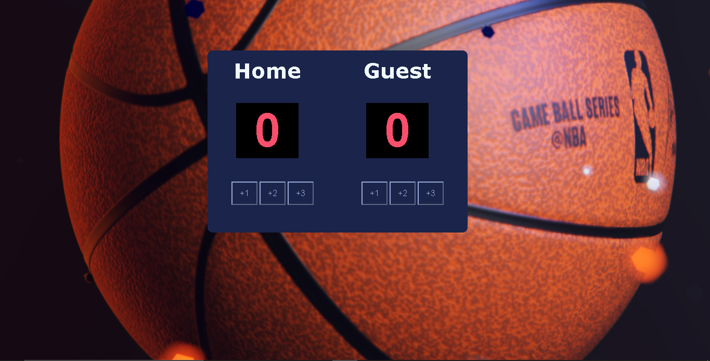

# Basketball Scoreboard

I don't play basketball but keep score of your games using this basketball app

## Table of contents

  - [Screenshot](#screenshot)
  - [Links](#links)
  - [Built with](#built-with)
  - [Continued development](#continued-development)
  - [Useful resources](#useful-resources)
- [Connect with me](#connect-with-me)

### Screenshot

### Links
- Live Site URL: [Netlify](https://zingy-gecko-9de069.netlify.app)

## My process

### Built with

- Semantic HTML5 markup
- CSS custom properties
- Flexbox
- Vanilla Js

### Continued development

- Learn more JavaScript

### Useful resources

- [W3Schools](https://www.w3schools.com/) - This really helped me with finding definations for certain HTML, JavaScript and CSS elements.

## Connect with me
- Twitter - [@masxho](https://twitter.com/masxho)
